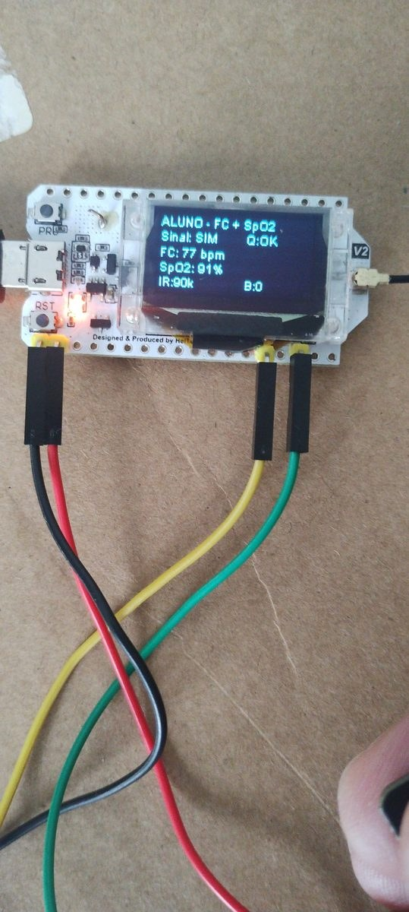

# ICNP/LoRa Professor

Arquitetura vestível experimental baseada em **LoRa ponto-a-ponto**, protocolo **ICNP** (*Intelligent Cooperative Node Protocol*), aquisição **PPG** com sensor MAX30102/MH-ET LIVE e visualização local em navegador/TV para acompanhamento técnico-operacional de dados fisiológicos experimentais.

O projeto implementa uma bancada com um nó **Professor** e um ou mais nós **Aluno**. O Professor coordena o ciclo de comunicação LoRa, envia `BEACON`, recebe `DATA`, confirma por `ACK`, recebe opcionalmente uma janela compacta `PPG` e disponibiliza os últimos estados dos Alunos em uma API HTTP local. Os nós Aluno fazem aquisição PPG experimental, estimam FC e SpO2, exibem informações no OLED e enviam os dados ao Professor.

> **Aviso importante:** este projeto é acadêmico e experimental. As leituras de frequência cardíaca e SpO2 são estimativas técnico-operacionais obtidas por PPG. Este repositório não é dispositivo médico, não realiza diagnóstico, não substitui equipamento clínico e não possui validação clínica.

---

## Demonstração visual

### Painel final da API local

O painel exibe **Tendência da FC**, **Tendência da SpO2** e **Onda PPG do pulso**. A curva roxa é o sinal óptico PPG normalizado; ela **não é ECG**. FC e SpO2 são tendências/estimativas calculadas.


### Visualização em TV

A API foi ajustada para uso em tela grande, permitindo acompanhamento local dos Alunos durante os ensaios.


### API administrativa Wi-Fi

O Professor pode ser configurado em outra rede sem recompilar o firmware. Quando não há rede salva ou a conexão falha, ele cria uma rede fallback para configuração local.


---

## 1. Visão geral da arquitetura

A arquitetura segue o modelo **Professor-Aluno**.

| Componente | Papel |
|---|---|
| Nó Professor | Coordena o ciclo ICNP, envia `BEACON`, recebe `DATA`, responde com `ACK`, recebe `PPG` opcional, mede RSSI/SNR e disponibiliza a API local |
| Nó Aluno | Aguarda `BEACON`, verifica se é o alvo do ciclo, lê o sensor PPG, monta `DATA`, transmite por LoRa, valida `ACK` e pode enviar janela `PPG` |
| ICNP | Protocolo textual de aplicação usado sobre LoRa para organizar o ciclo `BEACON -> DATA -> ACK -> PPG` |
| API local | Interface HTTP executada no Professor para visualizar os últimos estados recebidos dos Alunos |
| API Admin Wi-Fi | Página local para configurar SSID e senha do Professor sem recompilar o firmware |

Fluxo operacional atual:

```text
Professor envia BEACON com CICLO e ALVO
Aluno correspondente ao ALVO coleta os dados
Aluno envia DATA por LoRa
Professor recebe DATA e mede RSSI/SNR
Professor envia ACK
Aluno valida ACK
Aluno envia PPG opcional com janela normalizada do sinal óptico
Professor valida ALUNO, SEQ e CICLO do pacote PPG
Professor atualiza API local
```

---

## 2. Protocolo ICNP

### 2.1 BEACON

Mensagem enviada pelo Professor para abrir o ciclo e indicar qual Aluno pode responder.

```text
ICNP;TIPO=BEACON;PROFESSOR=1;CICLO=<ciclo>;ALVO=<aluno>
```

### 2.2 DATA

Mensagem principal enviada pelo Aluno com dados operacionais e estimativas fisiológicas experimentais.

```text
ICNP;TIPO=DATA;ALUNO=<id>;SEQ=<seq>;CICLO=<ciclo>;FC=<bpm>;SPO2=<%>;BAT=<V>;IR=<valor>;RED=<valor>;DEDO=<0|1>;QUAL=<OK|RUIM|NA>
```

Campos principais:

| Campo | Significado |
|---|---|
| `ALUNO` | Identificador do nó Aluno |
| `SEQ` | Sequência local do pacote |
| `CICLO` | Ciclo ICNP aberto pelo Professor |
| `FC` | Frequência cardíaca experimental |
| `SPO2` | Estimativa experimental de SpO2 |
| `BAT` | Tensão operacional do Aluno |
| `IR` | Valor bruto do canal infravermelho do MAX30102 |
| `RED` | Valor bruto do canal vermelho do MAX30102 |
| `DEDO` | Indicador de contato óptico/sinal válido |
| `QUAL` | Qualidade operacional da amostra |

### 2.3 ACK

Mensagem enviada pelo Professor confirmando o recebimento válido do `DATA`.

```text
ICNP;TIPO=ACK;PROFESSOR=1;ALUNO=<id>;SEQ=<seq>;CICLO=<ciclo>
```

O Aluno só considera o ciclo concluído quando o `ACK` recebido contém o mesmo `ALUNO`, a mesma `SEQ` e o mesmo `CICLO` do pacote `DATA` enviado.

### 2.4 PPG

Mensagem opcional enviada pelo Aluno após o `ACK`, contendo uma janela compacta do sinal PPG infravermelho normalizado.

```text
ICNP;TIPO=PPG;ALUNO=<id>;SEQ=<seq>;CICLO=<ciclo>;N=32;PPG=<janela_normalizada>
```

Exemplo real:

```text
ICNP;TIPO=PPG;ALUNO=1;SEQ=35;CICLO=15;N=32;PPG=165,167,175,184,183,118,53,21,20,28,66,106,122,116,123,140,158,175,192,201,204,209,223,231,235,168,78,47,46,65,96,118
```

O pacote `PPG` não substitui o `DATA`. Ele apenas envia uma janela curta para visualização da **onda PPG do pulso** no painel local.

---

## 3. Autômatos operacionais

### Professor


### Aluno


---

## 4. Hardware usado

### 4.1 Nó Professor

| Item | Função |
|---|---|
| Heltec WiFi LoRa 32 V2 | Placa principal com ESP32, rádio LoRa SX127x e OLED integrado |
| Antena LoRa 915 MHz | Comunicação LoRa ponto-a-ponto |
| Cabo USB | Alimentação, gravação do firmware e monitor serial |
| Notebook, celular ou TV com navegador | Acesso ao painel local e à página administrativa |

### 4.2 Nó Aluno

| Item | Função |
|---|---|
| Heltec WiFi LoRa 32 V2 | Placa principal do Aluno com ESP32, rádio LoRa SX127x e OLED integrado |
| MAX30102/MH-ET LIVE | Sensor óptico para aquisição PPG experimental |
| Antena LoRa 915 MHz | Comunicação LoRa ponto-a-ponto com o Professor |
| Bateria Li-ion/LiPo ou alimentação USB | Alimentação do nó Aluno |
| Jumpers/fios Dupont | Ligação I2C entre Heltec e MAX30102 |

### 4.3 Ligações principais do MAX30102

| MAX30102/MH-ET LIVE | Heltec WiFi LoRa 32 V2 |
|---|---|
| VIN/VCC | 3V3 ou 5V, conforme o módulo utilizado |
| GND | GND |
| SDA | GPIO4 / SDA |
| SCL | GPIO15 / SCL |

> Antes de alimentar o MAX30102 em 5 V, verifique o módulo utilizado. Alguns módulos possuem regulador e conversão de nível; outros exigem alimentação e nível lógico em 3,3 V.

### Bancada do sensor PPG




---

## 5. Software necessário

- Visual Studio Code
- Extensão PlatformIO IDE
- Git
- Driver USB da placa, se necessário
- Navegador web para acessar a API local

Bibliotecas principais usadas no PlatformIO:

- `sandeepmistry/LoRa`
- `thingpulse/ESP8266 and ESP32 OLED driver for SSD1306 displays`
- `sparkfun/SparkFun MAX3010x Pulse and Proximity Sensor Library`

---

## 6. Estrutura principal do projeto

```text
src/
├── comum/
│   ├── bateria.cpp
│   ├── bateria.h
│   ├── display_oled.h
│   ├── led_sync.cpp
│   ├── led_sync.h
│   ├── protocolo_icnp.cpp
│   ├── protocolo_icnp.h
│   ├── radio_lora.cpp
│   ├── radio_lora.h
│   ├── sensor_fisiologico.cpp
│   └── sensor_fisiologico.h
│
├── professor/
│   ├── api_professor.cpp
│   ├── api_professor.h
│   ├── config_wifi.cpp
│   ├── config_wifi.h
│   └── professor_main.cpp
│
├── aluno/
│   └── aluno_main.cpp
│
├── test/
├── .gitignore
├── platformio.ini
└── README.md
```

---

## 7. O que cada arquivo faz

### `src/professor/professor_main.cpp`

Arquivo principal do nó Professor.

Responsabilidades:

- inicializar rádio LoRa, OLED, bateria, LED de sincronismo e API local;
- alternar o `ALVO` entre os Alunos;
- enviar `BEACON`;
- aguardar e validar `DATA`;
- enviar `ACK`;
- abrir janela curta para receber `PPG` após o `ACK`;
- atualizar a estrutura de estado usada pela API;
- imprimir registros estruturados no monitor serial.

### `src/professor/api_professor.cpp`

Implementa o servidor HTTP local do Professor.

Responsabilidades:

- disponibilizar o dashboard web;
- expor `/api/status` em JSON;
- desenhar tendências de FC e SpO2;
- desenhar a onda PPG do pulso em modo esteira;
- aplicar cores operacionais para FC, SpO2 e bateria;
- interromper a onda PPG quando não há contato óptico válido;
- disponibilizar `/admin` e `/api/admin` para configuração Wi-Fi.

### `src/professor/config_wifi.cpp`

Implementa o provisionamento Wi-Fi.

Responsabilidades:

- carregar SSID e senha salvos na NVS do ESP32;
- tentar conexão em modo station;
- criar fallback `ICNP_PROFESSOR_SETUP` quando necessário;
- manter IP fallback `192.168.4.1`;
- salvar novas credenciais Wi-Fi;
- escanear redes próximas e alimentar a página administrativa.

### `src/aluno/aluno_main.cpp`

Arquivo principal do nó Aluno.

Responsabilidades:

- inicializar rádio LoRa, OLED, bateria, LED de sincronismo e sensor PPG;
- aguardar `BEACON`;
- validar se `ALVO` corresponde ao seu identificador;
- ler FC, SpO2, IR, RED, DEDO, QUAL e bateria;
- montar e enviar `DATA`;
- aguardar e validar `ACK`;
- enviar `PPG` opcional quando habilitado e quando há contato óptico adequado.

### `src/comum/sensor_fisiologico.cpp`

Módulo experimental do sensor MAX30102/MH-ET LIVE.

Responsabilidades:

- inicializar o sensor no barramento I2C;
- ler canais IR e RED;
- detectar presença de dedo/contato óptico;
- calcular FC experimental;
- calcular SpO2 experimental;
- manter buffer/janela PPG;
- normalizar a janela PPG para visualização;
- classificar qualidade operacional da amostra.

---

## 8. API local

### 8.1 Dashboard

```text
http://IP_DO_PROFESSOR/
```

Mostra:

- Alunos ativos;
- ciclo ICNP;
- sequência;
- FC experimental;
- SpO2 experimental;
- tendência temporal da FC;
- tendência temporal da SpO2;
- onda PPG do pulso em modo esteira;
- bateria do Aluno;
- energia do Professor;
- RSSI;
- SNR;
- idade da última atualização;
- estado de contato óptico;
- qualidade operacional.

### 8.2 Status JSON

```text
http://IP_DO_PROFESSOR/api/status
```

Retorna os últimos estados dos Alunos em JSON, incluindo a janela PPG quando disponível.

Exemplo simplificado:

```json
{
  "professor": 1,
  "sistema": "ICNP_PPG",
  "wifi": "STA",
  "alunos": [
    {
      "ativo": true,
      "aluno": 1,
      "seq": 57,
      "ciclo": 123,
      "fc": 67,
      "spo2": 96,
      "ir": 90554,
      "red": 23080,
      "ppg": [165,167,175,184,183,118,53,21],
      "ppg_n": 32,
      "dedo": 1,
      "qual": "OK",
      "rssi": -54,
      "snr": 9.5,
      "bat_aluno": 3.66
    }
  ]
}
```

### 8.3 Administração Wi-Fi

```text
http://IP_DO_PROFESSOR/admin
http://IP_DO_PROFESSOR/api/admin
```

Permite:

- visualizar modo atual de Wi-Fi;
- listar redes próximas;
- atualizar lista de redes;
- selecionar SSID;
- salvar senha;
- usar fallback sem recompilar o firmware.

---

## 9. Como implementar do zero

### Passo 1 - Clonar o repositório

```bash
git clone <URL_DO_REPOSITORIO>
cd <PASTA_DO_REPOSITORIO>
```

### Passo 2 - Abrir no VS Code

Abra a pasta do projeto no Visual Studio Code com a extensão PlatformIO instalada.

### Passo 3 - Conferir o `platformio.ini`

O projeto deve possuir ambientes separados para Professor, Aluno 1 e Aluno 2.

Exemplo:

```ini
[env:professor]
build_src_filter =
  +<professor/>
  +<comum/>
  -<aluno/>

[env:aluno1]
build_src_filter =
  +<aluno/>
  +<comum/>
  -<professor/>
build_flags =
  ${env.build_flags}
  -DID_ALUNO_CONFIG=\"1\"

[env:aluno2]
build_src_filter =
  +<aluno/>
  +<comum/>
  -<professor/>
build_flags =
  ${env.build_flags}
  -DID_ALUNO_CONFIG=\"2\"
```

### Passo 4 - Gravar o Professor

```bash
pio run -e professor -t upload
pio device monitor -b 115200
```

### Passo 5 - Gravar os Alunos

```bash
pio run -e aluno1 -t upload
pio run -e aluno2 -t upload
```

### Passo 6 - Configurar Wi-Fi do Professor

Se não houver rede salva, o Professor cria:

```text
SSID: ICNP_PROFESSOR_SETUP
Senha: icnp12345
IP: 192.168.4.1
```

Acesse:

```text
http://192.168.4.1/admin
```

Configure SSID e senha da rede do ambiente, salve e aguarde o reinício.

### Passo 7 - Acessar o dashboard

Com o Professor em modo station, acesse o IP informado no monitor serial:

```text
http://IP_DO_PROFESSOR/
http://IP_DO_PROFESSOR/api/status
```

---

## 10. Como testar

### Teste mínimo de comunicação

1. Grave o firmware do Professor.
2. Grave o firmware do Aluno.
3. Abra o Serial Monitor do Professor.
4. Ligue o Aluno.
5. Verifique se o Professor envia `BEACON`.
6. Verifique se o Aluno envia `DATA`.
7. Verifique se o Professor envia `ACK`.
8. Verifique se o Aluno valida o `ACK`.

### Teste com sensor PPG

1. Ligue Professor e Aluno.
2. Coloque o dedo no MAX30102.
3. Aguarde estabilização das leituras.
4. Observe `DEDO=1`.
5. Observe `QUAL=OK` quando a amostra estiver estável.
6. Confira FC, SpO2, IR e RED no Serial/OLED/API.
7. Retire o dedo.
8. Confirme se os campos passam para ausência de contato ou qualidade inadequada.

### Teste da onda PPG

1. Habilite o envio de `TIPO=PPG` no Aluno, se estiver em modo debug/controlado.
2. Execute o ciclo com o Professor.
3. Confirme no monitor serial do Professor:

```text
Recebido apos ACK: ICNP;TIPO=PPG;ALUNO=1;SEQ=<seq>;CICLO=<ciclo>;N=32;PPG=...
PPG debug valido
```

4. Abra o dashboard e veja a **Onda PPG do pulso**.
5. Retire o dedo e confira se a onda é interrompida por ausência de contato óptico.

---

## 11. Faixas visuais operacionais

As cores do dashboard são apoio visual operacional. Elas não representam diagnóstico.

### Frequência cardíaca experimental

| Faixa | Interpretação operacional |
|---|---|
| 50 a 120 bpm | Verde |
| 40 a 49 bpm ou 121 a 160 bpm | Atenção |
| Menor que 40 bpm ou maior que 160 bpm | Crítico operacional |

### SpO2 experimental

| Faixa | Interpretação operacional |
|---|---|
| 95% ou mais | Verde |
| 90% a 94% | Atenção |
| Menor que 90% | Crítico operacional |

### Bateria do Aluno

| Faixa | Interpretação operacional |
|---|---|
| 3,50 V ou mais | Verde |
| 3,20 V a 3,49 V | Atenção |
| Menor que 3,20 V | Crítico operacional |

---

## 12. Evidência complementar com oxímetro

Foi realizado um ensaio preliminar em repouso sentado com oxímetro comercial de dedo. Esse ensaio é apenas evidência técnico-operacional complementar, sem validação clínica.


---

## 13. Logs úteis

Exemplo de `DATA` recebido no Professor:

```text
Recebido: ICNP;TIPO=DATA;ALUNO=1;SEQ=27;CICLO=41;FC=70;SPO2=88;BAT=3.43;IR=91740;RED=24692;DEDO=1;QUAL=OK
RSSI DATA: -42 dBm
SNR DATA: 9.50 dB
Enviando ACK: ICNP;TIPO=ACK;PROFESSOR=1;ALUNO=1;SEQ=27;CICLO=41
```

Exemplo de `PPG` recebido após o `ACK`:

```text
Recebido apos ACK: ICNP;TIPO=PPG;ALUNO=1;SEQ=35;CICLO=15;N=32;PPG=165,167,175,184,183,118,53,21,20,28,66,106,122,116,123,140,158,175,192,201,204,209,223,231,235,168,78,47,46,65,96,118
RSSI PPG: -57 dBm
SNR PPG: 10.00 dB
PPG debug valido
```

---

## 14. Limitações conhecidas

- As leituras de FC e SpO2 são estimativas experimentais por PPG.
- O sistema não realiza validação clínica.
- O sistema não deve ser usado para diagnóstico.
- A onda exibida no painel é PPG óptica, não ECG.
- O desempenho do PPG depende de contato, pressão, posição do sensor e movimento.
- Ensaios com mobilidade intensa ainda exigem avaliação adicional.
- A autonomia energética ainda deve ser medida em campanha específica.
- A latência fim a fim ainda deve ser medida formalmente.
- A escalabilidade com muitos nós deve ser avaliada por novos ensaios ou emulação controlada.
- Acelerometria permanece como expansão futura.

---

## 15. Comandos Git sugeridos

Para versionar apenas README e figuras do README:

```bash
git status
git add README.md figuras_readme/
git commit -m "atualiza README com painel PPG e evidencias visuais"
git push
```

Se as alterações de firmware da API/PPG ainda não foram commitadas, use:

```bash
git status
git add README.md figuras_readme/ platformio.ini src/
git commit -m "integra pacote PPG e atualiza painel local do professor"
git push
```

Para criar uma tag da versão atual:

```bash
git tag v23-api-ppg-dashboard
git push origin v23-api-ppg-dashboard
```

No Windows, o Git pode exibir avisos como:

```text
LF will be replaced by CRLF the next time Git touches it
```

Esse aviso normalmente indica conversão de final de linha e não impede o commit.

---

## 16. Estado atual documentado

Estado técnico consolidado na V23:

- ICNP formalizado com `BEACON`, `DATA`, `ACK` e `PPG`;
- autômatos operacionais do Professor e do Aluno;
- sensor MAX30102/MH-ET LIVE integrado ao Aluno;
- FC e SpO2 tratadas como estimativas experimentais;
- janela PPG normalizada exibida como onda PPG do pulso;
- API local em navegador/TV;
- API Admin Wi-Fi com modo station, fallback e scan assíncrono;
- comparação preliminar com oxímetro em repouso sentado;
- roteiro técnico de reprodução na dissertação.

---

## 17. Aviso de uso

Este projeto demonstra integração funcional entre sensor PPG, protocolo ICNP, LoRa e visualização local. As informações exibidas devem ser usadas apenas para avaliação técnica e operacional do protótipo.
