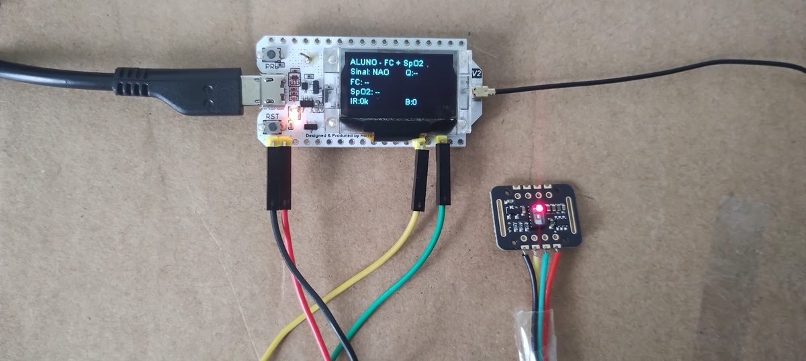
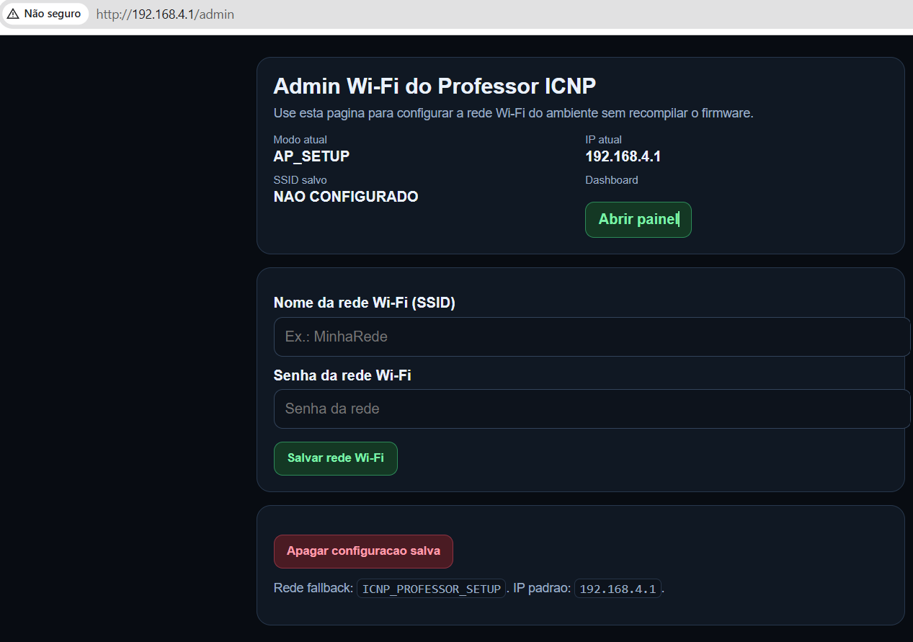
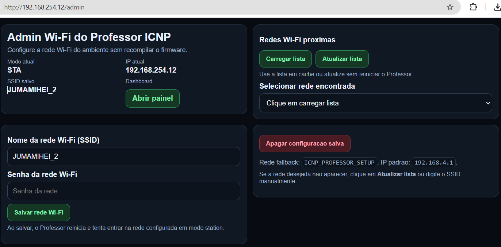
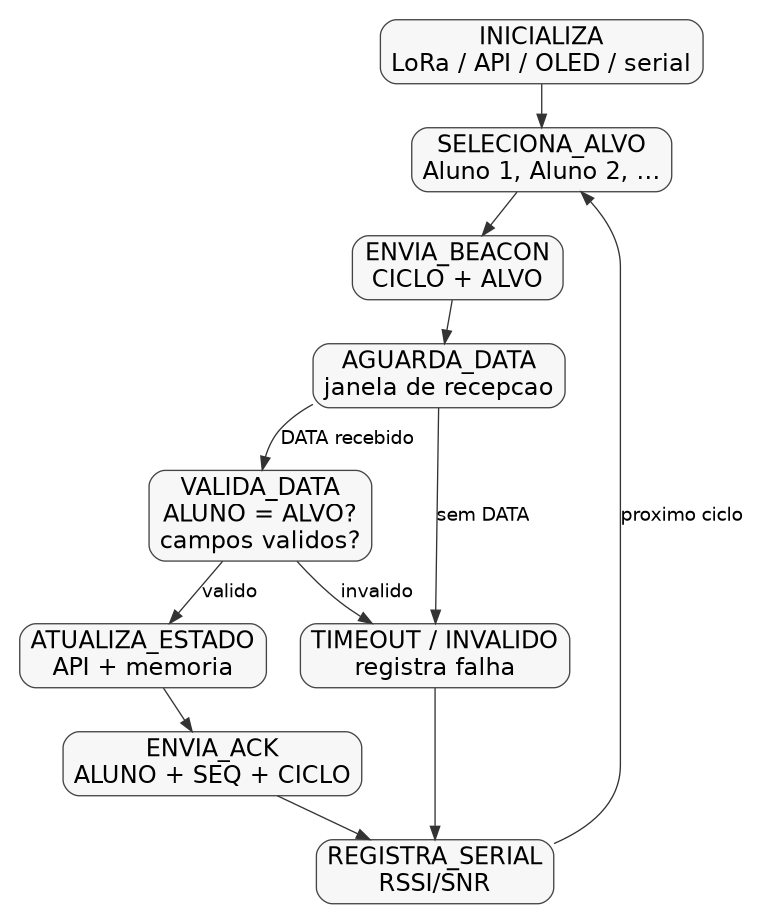
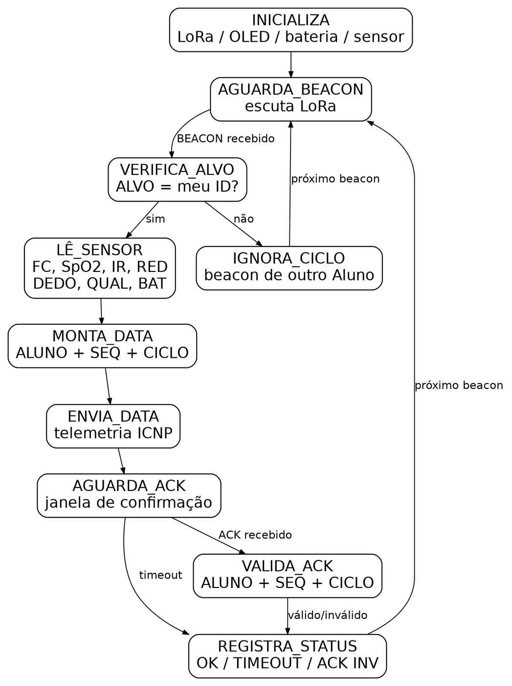
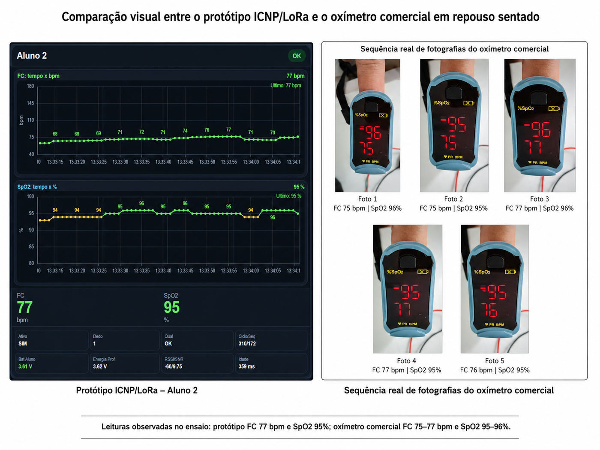

# ICNP/LoRa Professor

Guia prático para reproduzir uma bancada **Professor-Aluno** com comunicação **LoRa**, protocolo **ICNP**, sensor **MAX30102/MH-ET LIVE** e painel local em navegador/TV.

> Projeto acadêmico e experimental. As leituras de FC e SpO2 são estimativas técnico-operacionais por PPG. Este projeto não é dispositivo médico, não realiza diagnóstico e não substitui equipamento clínico.

---

## Resultado esperado

Ao final da reprodução, o nó **Professor** deve:

- alternar chamadas para os nós Aluno por LoRa;
- receber pacotes `DATA` com FC, SpO2, bateria, IR, RED, DEDO e QUAL;
- responder com `ACK`;
- receber pacote opcional `PPG` com uma janela da onda PPG;
- disponibilizar um painel local em navegador/TV.


---

## Hardware necessário

| Quantidade | Item | Uso |
|---:|---|---|
| 1 | Heltec WiFi LoRa 32 V2 | Nó Professor |
| 1 ou 2 | Heltec WiFi LoRa 32 V2 | Nós Aluno |
| 1 ou 2 | MAX30102/MH-ET LIVE | Sensor PPG dos Alunos |
| 2 ou 3 | Antenas LoRa 915 MHz | Comunicação LoRa |
| 2 ou 3 | Cabos USB | Gravação, alimentação e serial |
| 1 | Notebook com VS Code + PlatformIO | Compilação e monitor serial |
| opcional | TV/navegador | Visualização do painel |

---

## Ligações do MAX30102 no Aluno

| MAX30102/MH-ET LIVE | Heltec WiFi LoRa 32 V2 |
|---|---|
| VCC/VIN | 3V3 ou 5V, conforme o módulo |
| GND | GND |
| SDA | GPIO 4 |
| SCL | GPIO 15 |

> Confira o seu módulo antes de usar 5 V. Alguns módulos possuem regulador e conversão de nível, outros devem operar em 3,3 V.



---

## Software necessário

Instale:

1. Visual Studio Code;
2. extensão PlatformIO IDE;
3. Git;
4. driver USB da placa, se necessário.

Bibliotecas usadas pelo `platformio.ini`:

```ini
sandeepmistry/LoRa
thingpulse/ESP8266 and ESP32 OLED driver for SSD1306 displays
sparkfun/SparkFun MAX3010x Pulse and Proximity Sensor Library
```

---

## Clonar o projeto

```bash
git clone https://github.com/araujovirtual/icnp-lora-professor.git
cd icnp-lora-professor
```

Abra a pasta no VS Code.

---

## Configurar portas seriais

No arquivo `platformio.ini`, ajuste as portas conforme o seu computador.

Exemplo:

```ini
[env:professor]
upload_port = COM5
monitor_port = COM5

[env:aluno1]
upload_port = COM9
monitor_port = COM9

[env:aluno2]
upload_port = COM12
monitor_port = COM12
```

No Windows, veja a porta no **Gerenciador de Dispositivos**. Em outro computador, troque `COM5`, `COM9` e `COM12` pelas portas reais.

---

## Gravar o firmware

### Professor

```bash
pio run -e professor -t upload
pio device monitor -e professor
```

### Aluno 1

```bash
pio run -e aluno1 -t upload
pio device monitor -e aluno1
```

### Aluno 2

```bash
pio run -e aluno2 -t upload
pio device monitor -e aluno2
```

O identificador do Aluno é definido no `platformio.ini` por `ID_ALUNO_CONFIG`.

---

## Configurar o Wi-Fi do Professor

O Professor tenta conectar na rede Wi-Fi salva. Se não houver rede configurada, ele cria uma rede fallback.

### Modo fallback

1. Ligue o Professor.
2. Procure a rede:

```text
ICNP_PROFESSOR_SETUP
```

3. Senha:

```text
icnp12345
```

4. Acesse no navegador:

```text
http://192.168.4.1/admin
```

5. Selecione ou digite o SSID da rede local.
6. Informe a senha.
7. Salve.
8. O Professor reinicia e tenta entrar em modo station.



### Modo station

Depois de conectado, o IP aparece no monitor serial do Professor.

Acesse:

```text
http://<IP_DO_PROFESSOR>/
```

Admin:

```text
http://<IP_DO_PROFESSOR>/admin
```



---

## Executar o teste de bancada

1. Conecte antenas LoRa nas placas.
2. Ligue o Professor.
3. Ligue o Aluno 1.
4. Opcionalmente, ligue o Aluno 2.
5. Abra o monitor serial do Professor.
6. Coloque o dedo no sensor MAX30102 do Aluno.
7. Aguarde o Professor alternar `ALVO=1` e `ALVO=2`.
8. Acesse a API pelo navegador.

---

## O que deve aparecer no serial do Professor

Fluxo esperado:

```text
Enviando BEACON: ICNP;TIPO=BEACON;PROFESSOR=1;CICLO=15;ALVO=1
Recebido: ICNP;TIPO=DATA;ALUNO=1;SEQ=35;CICLO=15;FC=73;SPO2=96;BAT=3.71;IR=90554;RED=23080;DEDO=1;QUAL=OK
Enviando ACK: ICNP;TIPO=ACK;PROFESSOR=1;ALUNO=1;SEQ=35;CICLO=15
Recebido apos ACK: ICNP;TIPO=PPG;ALUNO=1;SEQ=35;CICLO=15;N=32;PPG=...
```

O pacote `DATA` carrega os valores resumidos. O pacote `PPG` carrega uma janela curta para desenhar a onda PPG do pulso na API.

---

## O que deve aparecer no serial do Aluno

```text
BEACON RECEBIDO PARA ESTE ALUNO
FC enviada: 75
SpO2 enviado: 95
Dedo: SIM
Qualidade: OK
Enviando DATA: ICNP;TIPO=DATA;...
ACK valido. Ciclo ICNP concluido.
Enviando PPG debug: ICNP;TIPO=PPG;...
```

Sem dedo no sensor, o esperado é `DEDO=0`, `QUAL=NA` e ausência da onda PPG no painel.

---

## Verificar a API

Endpoint JSON:

```text
http://<IP_DO_PROFESSOR>/api/status
```

Campos principais por Aluno:

| Campo | Significado |
|---|---|
| `fc` | Frequência cardíaca experimental |
| `spo2` | Estimativa experimental de SpO2 |
| `ir` | Canal infravermelho bruto |
| `red` | Canal vermelho bruto |
| `dedo` | Presença de contato óptico |
| `qual` | Qualidade operacional da amostra |
| `bat_aluno` | Tensão operacional do Aluno |
| `rssi` / `snr` | Métricas LoRa |
| `ppg` | Janela normalizada da onda PPG |

---

## Protocolo ICNP usado

```text
BEACON -> DATA -> ACK -> PPG opcional
```

Formatos:

```text
ICNP;TIPO=BEACON;PROFESSOR=1;CICLO=<n>;ALVO=<id>
```

```text
ICNP;TIPO=DATA;ALUNO=<id>;SEQ=<seq>;CICLO=<n>;FC=<bpm>;SPO2=<%>;BAT=<V>;IR=<valor>;RED=<valor>;DEDO=<0|1>;QUAL=<OK|RUIM|NA>
```

```text
ICNP;TIPO=ACK;PROFESSOR=1;ALUNO=<id>;SEQ=<seq>;CICLO=<n>
```

```text
ICNP;TIPO=PPG;ALUNO=<id>;SEQ=<seq>;CICLO=<n>;N=32;PPG=<janela_normalizada>
```

---

## Estrutura do projeto

```text
src/
  comum/
    bateria.cpp / bateria.h
    display_oled.h
    led_sync.cpp / led_sync.h
    protocolo_icnp.cpp / protocolo_icnp.h
    radio_lora.cpp / radio_lora.h
    sensor_fisiologico.cpp / sensor_fisiologico.h

  professor/
    professor_main.cpp
    api_professor.cpp / api_professor.h
    config_wifi.cpp / config_wifi.h

  aluno/
    aluno_main.cpp

platformio.ini
README.md
```

---

## Teste rápido de funcionamento

Use esta lista para saber se a bancada está correta:

- [ ] Professor imprime ciclos ICNP no serial.
- [ ] Aluno recebe `BEACON`.
- [ ] Aluno responde apenas quando `ALVO` é o seu ID.
- [ ] Professor recebe `DATA`.
- [ ] Professor envia `ACK`.
- [ ] Aluno valida `ACK`.
- [ ] Com dedo no sensor, aparece `DEDO=1` e `QUAL=OK`.
- [ ] API abre no navegador.
- [ ] API mostra FC, SpO2, bateria, RSSI/SNR.
- [ ] API mostra a onda PPG do pulso.
- [ ] Sem dedo, a onda PPG para e aparece ausência de contato óptico.

---

## Solução de problemas

### Sensor MAX30102 não encontrado

Verifique:

- VCC/GND;
- SDA no GPIO 4;
- SCL no GPIO 15;
- endereço I2C `0x57`;
- alimentação compatível com o módulo.

### Professor não conecta no Wi-Fi

Use a rede fallback:

```text
SSID: ICNP_PROFESSOR_SETUP
Senha: icnp12345
IP: 192.168.4.1
```

Depois acesse:

```text
http://192.168.4.1/admin
```

### API abre, mas não aparecem dados

Verifique se o Professor está recebendo `DATA` no monitor serial.

Se o LoRa não estiver recebendo, a API abre mas não tem dados novos.

### Onda PPG não aparece

Verifique:

- dedo bem posicionado no sensor;
- `DEDO=1`;
- `QUAL=OK`;
- pacote `PPG` recebido após o `ACK` no serial do Professor.

### Aluno 2 não responde

Confira se o ambiente correto foi gravado:

```ini
-DID_ALUNO_CONFIG="2"
```

---

## Evidências visuais complementares

### Autômatos ICNP





### Comparação preliminar com oxímetro

A comparação é apenas técnico-operacional e preliminar, em repouso sentado. Não representa validação clínica.



---

## Limites do projeto

Este repositório demonstra uma arquitetura experimental. Ainda não cobre:

- validação fisiológica formal;
- certificação de desempenho;
- teste com muitos participantes;
- teste esportivo em movimento real;
- autonomia medida com instrumento dedicado;
- fixação mecânica definitiva em luva ou pulseira.

---

## Licença

Projeto acadêmico desenvolvido para fins de pesquisa e reprodução experimental.

