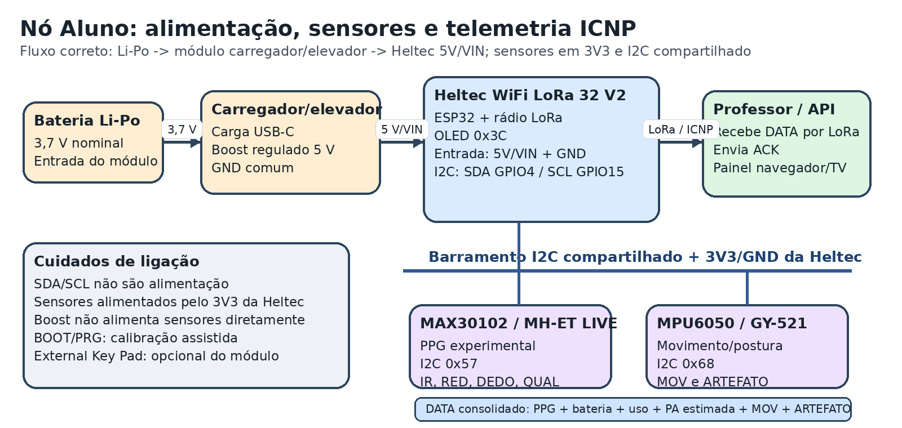
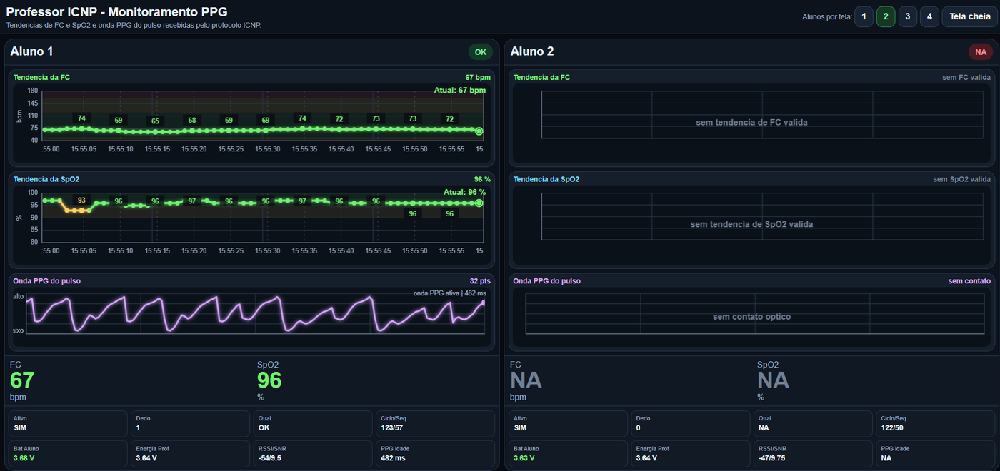
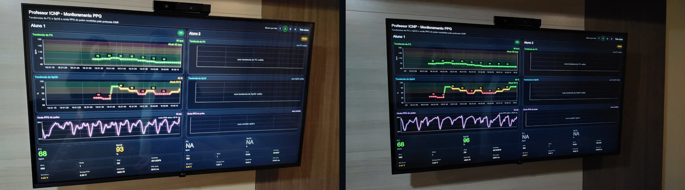
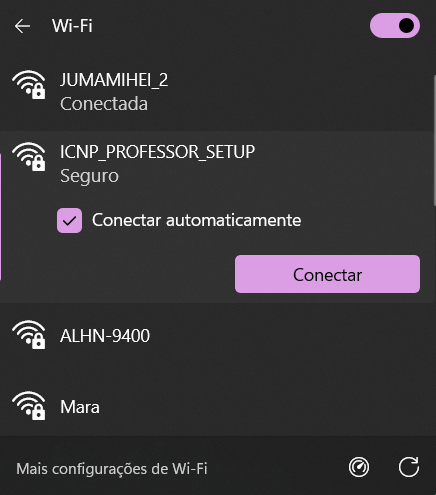
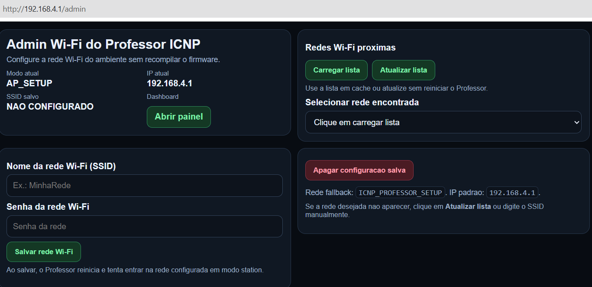
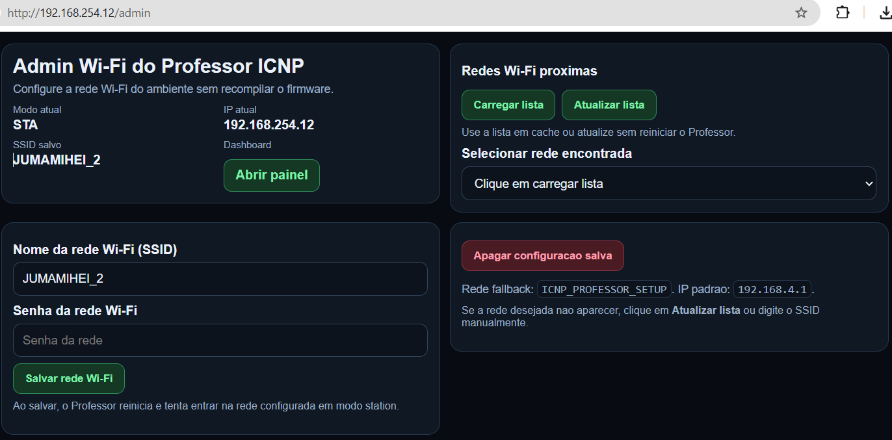
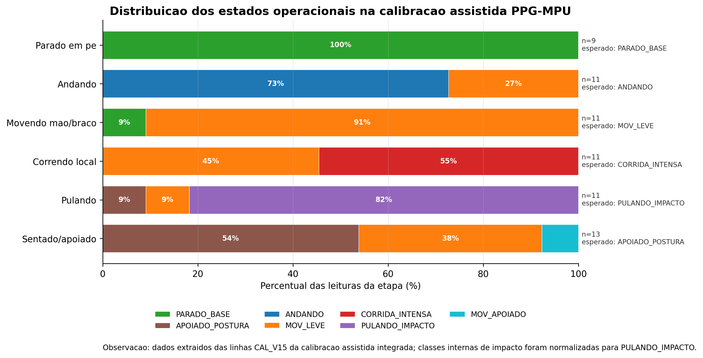
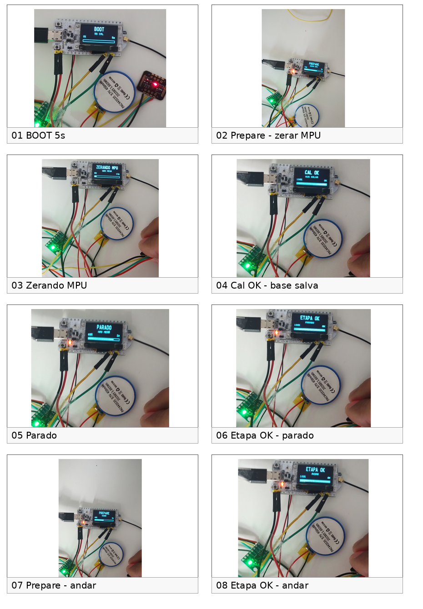
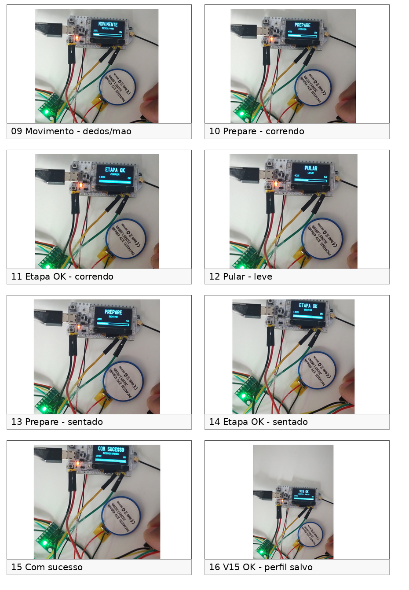

# ICNP/LoRa Professor-Aluno

Guia prático para reproduzir uma bancada **Professor-Aluno** com comunicação **LoRa**, protocolo **ICNP**, sensor **MAX30102/MH-ET LIVE**, camada inercial **MPU6050/GY-521** quando habilitada, display OLED e painel local em navegador/TV.

> Projeto acadêmico e experimental. As leituras de FC e SpO2 são estimativas técnico-operacionais por PPG. Este projeto não é dispositivo médico, não realiza diagnóstico, não substitui equipamento clínico e não caracteriza validação fisiológica formal.

---

## Estado atual do projeto

Este repositório acompanha a versão final da dissertação **Arquitetura vestível com comunicação LoRa, protocolo ICNP e visualização local para monitoramento fisiológico experimental de atletas**.

A versão consolidada trata o sistema como uma **arquitetura vestível experimental**, e não como uma luva final obrigatória. A luva aparece apenas como suporte exploratório de bancada. O foco principal está na arquitetura Professor-Aluno, no protocolo ICNP, na telemetria LoRa, na aquisição PPG experimental, na camada inercial de movimento/postura, no painel local e na rastreabilidade dos ensaios.

Principais pontos consolidados:

- ciclo ICNP `BEACON -> DATA -> ACK`;
- pacote complementar opcional `PPG` após ACK válido;
- seleção de nós Aluno pelo campo `ALVO`;
- operação com dois nós Aluno físicos nos ensaios documentados;
- aquisição PPG com MAX30102/MH-ET LIVE;
- estimativas experimentais de FC e SpO2;
- campos auxiliares sintéticos para testar extensibilidade do payload;
- estados derivados de movimento/postura e artefato por MPU6050/GY-521, quando presentes no firmware final;
- painel local no nó Professor por API HTTP;
- modo Wi-Fi station e fallback de configuração;
- exportação operacional de registros em TXT, XLSX e PNG;
- alimentação estabilizada do nó Aluno por módulo carregador/elevador Li-Po;
- documentação de limites: sem diagnóstico, sem validação clínica e sem certificação fisiológica.

---

## Resultado esperado

Ao final da reprodução, o nó **Professor** deve:

- alternar chamadas para os nós Aluno por LoRa;
- enviar `BEACON` com `CICLO` e `ALVO`;
- receber pacotes `DATA` do Aluno chamado;
- validar identificador, sequência e ciclo;
- responder com `ACK`;
- receber, quando habilitado, o pacote opcional `PPG` com uma janela normalizada da onda PPG;
- manter o último estado dos Alunos em memória;
- disponibilizar painel local em navegador/TV;
- expor endpoint JSON para consulta do estado recente;
- permitir configuração Wi-Fi local sem recompilar o firmware.

O nó **Aluno** deve:

- aguardar `BEACON`;
- responder apenas quando `ALVO` corresponder ao seu `ID_ALUNO_CONFIG`;
- coletar dados PPG experimentais;
- montar `DATA` com os campos disponíveis;
- aguardar e validar o `ACK`;
- enviar `PPG` opcional após ACK válido, quando houver sinal óptico adequado.

---

## Hardware necessário

| Quantidade | Item | Uso |
|---:|---|---|
| 1 | Heltec WiFi LoRa 32 V2 | Nó Professor |
| 1 ou 2 | Heltec WiFi LoRa 32 V2 | Nós Aluno |
| 1 ou 2 | MAX30102/MH-ET LIVE | Sensor PPG dos Alunos |
| 1 ou 2 | MPU6050/GY-521 | Movimento/postura/artefato operacional, quando habilitado |
| 2 ou 3 | Antenas LoRa 915 MHz | Comunicação LoRa |
| 2 ou 3 | Cabos USB | Gravação, alimentação e monitor serial |
| 1 | Notebook com VS Code + PlatformIO | Compilação, gravação e monitoramento |
| opcional | Módulo carregador/elevador Li-Po | Alimentação estabilizada do nó Aluno |
| opcional | Bateria Li-Po 3,7 V | Alimentação do protótipo vestível |
| opcional | TV ou navegador | Visualização do painel local |

---

## Ligações do nó Aluno

Nos ensaios integrados, OLED, MAX30102 e MPU6050 compartilham o barramento I2C da Heltec.

| Sinal/dispositivo | Heltec WiFi LoRa 32 V2 |
|---|---|
| SDA | GPIO 4 |
| SCL | GPIO 15 |
| GND dos sensores | GND comum |
| VCC MAX30102/MH-ET LIVE | 3V3 da Heltec, conforme módulo usado |
| VCC MPU6050/GY-521 | 3V3 da Heltec, conforme módulo usado |
| OLED integrado | 0x3C |
| MAX30102/MH-ET LIVE | 0x57 |
| MPU6050/GY-521 | 0x68 |

> Confira o seu módulo antes de usar 5 V. Alguns módulos possuem regulador e conversão de nível; outros devem operar em 3,3 V. Na versão consolidada da dissertação, os sensores foram tratados como alimentados pelo 3V3 da Heltec, com GND comum.

### Observação sobre I2C

Nos ensaios de bancada, o barramento I2C foi mantido curto e utilizou a infraestrutura elétrica da placa Heltec e dos módulos de desenvolvimento. Não foram adicionados resistores externos dedicados nessa etapa. Em uma versão final encapsulada, recomenda-se revisar valores de pull-up, comprimento do barramento, capacitância total e roteamento físico.

---

## Alimentação estabilizada

Na etapa final do protótipo, foi documentado o uso de um módulo carregador/elevador Li-Po:

```text
Bateria Li-Po 3,7 V -> carregador/elevador -> 5 V/VIN da Heltec
Heltec 3V3 -> MAX30102 e MPU6050
GND comum entre módulo de energia, Heltec e sensores
```

O terminal `External Key Pad` do módulo de alimentação é apenas entrada opcional para botão do próprio módulo. Ele não substitui o botão `BOOT/PRG` da Heltec usado no acionamento da calibração assistida.

---

## Esquemático de hardware consolidado

A figura abaixo resume a arquitetura de aquisição e transmissão do nó Aluno, incluindo Heltec, MAX30102, MPU6050, OLED compartilhando o barramento I2C e a alimentação estabilizada por módulo carregador/elevador Li-Po.



---

## Último painel válido da API local

O painel abaixo representa a visualização consolidada da API local do Professor, com tendências de FC e SpO2, onda PPG, marcadores temporais e telemetria recente dos nós Aluno.



Visualização complementar do painel em TV/navegador:



---

## Software necessário

Instale:

1. Visual Studio Code;
2. extensão PlatformIO IDE;
3. Git;
4. driver USB da placa, se necessário.

Bibliotecas usadas pelo `platformio.ini` atual:

```ini
olikraus/U8g2
sandeepmistry/LoRa
thingpulse/ESP8266 and ESP32 OLED driver for SSD1306 displays
sparkfun/SparkFun MAX3010x Pulse and Proximity Sensor Library
```

---

## Clonar o projeto

```bash
git clone https://github.com/araujovirtual/icnp-lora-professor.git
cd icnp-lora-professor
```

Abra a pasta no VS Code.

---

## Configurar o `platformio.ini`

O arquivo `platformio.ini` define qual código será gravado em cada placa e qual porta serial será usada.

Ambientes principais:

| Ambiente | Função | ID gravado no firmware |
|---|---|---|
| `professor` | Nó central que envia `BEACON`, recebe `DATA`, envia `ACK` e abre a API | não usa `ID_ALUNO_CONFIG` |
| `aluno1` | Primeiro nó Aluno | `ID_ALUNO_CONFIG="1"` |
| `aluno2` | Segundo nó Aluno | `ID_ALUNO_CONFIG="2"` |

Exemplo de configuração:

```ini
[env]
platform = espressif32
board = heltec_wifi_lora_32_V2
framework = arduino
monitor_speed = 115200
lib_deps =
    olikraus/U8g2
    sandeepmistry/LoRa
    thingpulse/ESP8266 and ESP32 OLED driver for SSD1306 displays
    sparkfun/SparkFun MAX3010x Pulse and Proximity Sensor Library

build_flags =
    -I src/comum

[env:professor]
build_src_filter =
    +<professor/>
    +<comum/>
    -<aluno/>
upload_port = COM5
monitor_port = COM5

[env:aluno1]
build_src_filter =
    +<aluno/>
    +<comum/>
    -<professor/>
upload_port = COM14
monitor_port = COM14
build_flags =
    ${env.build_flags}
    -DID_ALUNO_CONFIG=\"1\"

[env:aluno2]
build_src_filter =
    +<aluno/>
    +<comum/>
    -<professor/>
upload_port = COM16
monitor_port = COM16
build_flags =
    ${env.build_flags}
    -DID_ALUNO_CONFIG=\"2\"
```

As portas `COM5`, `COM14` e `COM16` são as portas usadas no recorte atual; ajuste se o seu Windows indicar portas diferentes. No Windows, veja as portas em:

```text
Gerenciador de Dispositivos > Portas (COM e LPT)
```

No Linux/macOS, use caminhos como:

```text
/dev/ttyUSB0
/dev/ttyACM0
/dev/cu.usbserial-*
```

---

## Como criar mais nós Aluno

Os nós Aluno usam o mesmo código-fonte. O que muda é apenas o número gravado em `ID_ALUNO_CONFIG`.

Para criar um `aluno3`, copie o bloco do `aluno2`, troque o nome do ambiente, a porta serial e o número do ID:

```ini
[env:aluno3]
build_src_filter =
    +<aluno/>
    +<comum/>
    -<professor/>
upload_port = COM17
monitor_port = COM17
build_flags =
    ${env.build_flags}
    -DID_ALUNO_CONFIG=\"3\"
```

> A dissertação validou a operação com dois Alunos físicos. Para ampliar para mais Alunos, ajuste também no firmware do Professor a lista ou a quantidade de Alunos chamados pelo campo `ALVO`, além de revisar tempo de ciclo, janela de espera, taxa LoRa e envio do pacote `PPG`.

---

## Gravar e monitorar o firmware

Com o `platformio.ini` ajustado, grave uma placa por vez.

```bash
pio run -e professor -t upload
pio device monitor -e professor
```

```bash
pio run -e aluno1 -t upload
pio device monitor -e aluno1
```

```bash
pio run -e aluno2 -t upload
pio device monitor -e aluno2
```

Se dois nós forem gravados com o mesmo `ID_ALUNO_CONFIG`, ambos tentarão responder ao mesmo `ALVO`, causando conflito no teste multialuno.

---

## Configurar o Wi-Fi do Professor

O Professor tenta conectar à rede Wi-Fi salva. Se não houver rede configurada ou se a conexão falhar, ele cria uma rede fallback para configuração local.

### Modo fallback

No primeiro uso, ou quando a conexão com a rede salva falhar, procure no Windows/celular a rede criada pelo Professor:

```text
SSID: ICNP_PROFESSOR_SETUP
Senha: icnp12345
IP: 192.168.4.1
Página: http://192.168.4.1/admin
```



Depois de conectar o notebook ou celular nessa rede, abra o navegador em:

```text
http://192.168.4.1/admin
```

A tela administrativa permite selecionar a rede Wi-Fi local, informar a senha e salvar a configuração.



### Modo station

Depois de salvar a rede local, o Professor reinicia e tenta conectar em modo station. Quando a conexão é concluída, o IP aparece no monitor serial e o painel pode ser acessado por qualquer dispositivo na mesma rede.

```text
Painel: http://<IP_DO_PROFESSOR>/
Admin:  http://<IP_DO_PROFESSOR>/admin
JSON:   http://<IP_DO_PROFESSOR>/api/status
```

A tela administrativa em modo station também permite verificar redes detectadas e refazer a configuração quando necessário.



---

## Executar o teste de bancada

1. Conecte antenas LoRa nas placas.
2. Ligue o Professor.
3. Ligue o Aluno 1.
4. Opcionalmente, ligue o Aluno 2.
5. Abra o monitor serial do Professor.
6. Coloque o dedo no sensor MAX30102 do Aluno.
7. Aguarde o Professor alternar `ALVO=1` e `ALVO=2`.
8. Acesse a API pelo navegador.

---

## Protocolo ICNP usado

Fluxo principal:

```text
BEACON -> DATA -> ACK
```

Fluxo com janela PPG opcional:

```text
BEACON -> DATA -> ACK -> PPG opcional
```

### BEACON

```text
ICNP;TIPO=BEACON;PROFESSOR=1;CICLO=<n>;ALVO=<id>
```

### DATA, formato mínimo

```text
ICNP;TIPO=DATA;ALUNO=<id>;SEQ=<seq>;CICLO=<n>;FC=<bpm>;SPO2=<%>;BAT=<V>;IR=<valor>;RED=<valor>;DEDO=<0|1>;QUAL=<OK|RUIM|NA>
```

### DATA, formato estendido consolidado

```text
ICNP;TIPO=DATA;ALUNO=<id>;SEQ=<seq>;CICLO=<n>;FC=<bpm>;SPO2=<%>;BAT=<V>;IR=<valor>;RED=<valor>;DEDO=<0|1>;QUAL=<OK|RUIM|NA>;AUX_SYS=<aux>;AUX_DIA=<aux>;AUX_VALIDO=<0|1>;USO=<estado>;SINAL_PPG=<estado>;MOV=<classe>;ARTEFATO=<classe>
```

### ACK

```text
ICNP;TIPO=ACK;PROFESSOR=1;ALUNO=<id>;SEQ=<seq>;CICLO=<n>
```

### PPG opcional

```text
ICNP;TIPO=PPG;ALUNO=<id>;SEQ=<seq>;CICLO=<n>;N=32;PPG=<janela_normalizada>
```

---

## Campos principais do DATA

| Campo | Significado |
|---|---|
| `ALUNO` | Identificador do nó Aluno |
| `SEQ` | Sequência local do Aluno |
| `CICLO` | Ciclo aberto pelo Professor |
| `FC` | Frequência cardíaca experimental |
| `SPO2` | Estimativa experimental de SpO2 |
| `BAT` | Tensão operacional do Aluno |
| `IR` | Canal infravermelho bruto do MAX30102 |
| `RED` | Canal vermelho bruto do MAX30102 |
| `DEDO` | Indicador de contato óptico |
| `QUAL` | Qualidade operacional da amostra |
| `AUX_SYS` / `AUX_DIA` | Campos auxiliares sintéticos de teste, sem unidade fisiológica |
| `AUX_VALIDO` | Validade operacional do bloco auxiliar sintético |
| `USO` | Estado de uso do sensor |
| `SINAL_PPG` | Estado operacional do sinal PPG |
| `MOV` | Estado derivado de movimento/postura |
| `ARTEFATO` | Estado operacional de artefato |

`AUX_SYS`, `AUX_DIA` e `AUX_VALIDO` não representam pressão arterial, não possuem significado clínico e são mantidos apenas para exercitar a extensibilidade do pacote e da API.

---

## Exemplo de serial do Professor

```text
Enviando BEACON: ICNP;TIPO=BEACON;PROFESSOR=1;CICLO=15;ALVO=1
Recebido: ICNP;TIPO=DATA;ALUNO=1;SEQ=35;CICLO=15;FC=73;SPO2=96;BAT=3.71;IR=90554;RED=23080;DEDO=1;QUAL=OK
Enviando ACK: ICNP;TIPO=ACK;PROFESSOR=1;ALUNO=1;SEQ=35;CICLO=15
Recebido apos ACK: ICNP;TIPO=PPG;ALUNO=1;SEQ=35;CICLO=15;N=32;PPG=...
```

Se o firmware estiver na versão estendida com PPG-MPU, o pacote pode incluir também `USO`, `SINAL_PPG`, `MOV`, `ARTEFATO` e campos auxiliares sintéticos.

### Log operacional mais completo do Professor

```text
===== CICLO ICNP =====
Ciclo: 97
Alvo: ALUNO 1
Energia Professor: 3.71 V
Enviando BEACON: ICNP;TIPO=BEACON;PROFESSOR=1;CICLO=97;ALVO=1
Recebido: ICNP;TIPO=DATA;ALUNO=1;SEQ=97;CICLO=97;FC=94;SPO2=97;BAT=3.98;IR=98231;RED=25410;DEDO=1;QUAL=OK;AUX_SYS=121;AUX_DIA=78;AUX_VALIDO=1;USO=USANDO;SINAL_PPG=PPG_ATIVO;MOV=PARADO_2_RECUPERACAO;ARTEFATO=SEM_ARTEFATO
Enviando ACK: ICNP;TIPO=ACK;PROFESSOR=1;ALUNO=1;SEQ=97;CICLO=97
Recebido apos ACK: ICNP;TIPO=PPG;ALUNO=1;SEQ=97;CICLO=97;N=32;PPG=518,522,529,541,560,581,603,620,628,624,608,586,560,536,522,516,519,531,549,571,595,614,625,622,607,585,561,540,524,516,517,518
RSSI recebido: -65 dBm | SNR: 8.25 dB
```

### Log operacional de referência do Aluno

```text
BEACON RECEBIDO PARA ESTE ALUNO
Ciclo recebido: 97
FC enviada: 94
SpO2 enviada: 97
Dedo: SIM
Qualidade: OK
USO: USANDO
SINAL_PPG: PPG_ATIVO
MOV: PARADO_2_RECUPERACAO
ARTEFATO: SEM_ARTEFATO
Enviando DATA: ICNP;TIPO=DATA;ALUNO=1;SEQ=97;CICLO=97;FC=94;SPO2=97;BAT=3.98;IR=98231;RED=25410;DEDO=1;QUAL=OK;AUX_SYS=121;AUX_DIA=78;AUX_VALIDO=1;USO=USANDO;SINAL_PPG=PPG_ATIVO;MOV=PARADO_2_RECUPERACAO;ARTEFATO=SEM_ARTEFATO
ACK valido. Ciclo ICNP concluido.
Enviando PPG debug: ICNP;TIPO=PPG;ALUNO=1;SEQ=97;CICLO=97;N=32;PPG=518,522,529,541,560,581,603,620,628,624,608,586,560,536,522,516,519,531,549,571,595,614,625,622,607,585,561,540,524,516,517,518
```

### Exemplo resumido de resposta JSON da API

```json
{
  "aluno1": {
    "id": "1",
    "fc": 94,
    "spo2": 97,
    "bat_aluno": 3.98,
    "ir": 98231,
    "red": 25410,
    "dedo": 1,
    "qual": "OK",
    "uso": "USANDO",
    "sinal_ppg": "PPG_ATIVO",
    "mov": "PARADO_2_RECUPERACAO",
    "artefato": "SEM_ARTEFATO",
    "rssi": -65,
    "snr": 8.25,
    "ppg_n": 32,
    "ppg": [518, 522, 529, 541, 560, 581, 603, 620]
  }
}
```

---

## API local

Endpoint JSON:

```text
http://<IP_DO_PROFESSOR>/api/status
```

Campos principais por Aluno:

| Campo | Significado |
|---|---|
| `fc` | Frequência cardíaca experimental |
| `spo2` | Estimativa experimental de SpO2 |
| `ir` | Canal infravermelho bruto |
| `red` | Canal vermelho bruto |
| `dedo` | Presença de contato óptico |
| `qual` | Qualidade operacional da amostra |
| `bat_aluno` | Tensão operacional do Aluno |
| `rssi` / `snr` | Métricas LoRa |
| `ppg` | Janela normalizada da onda PPG |

A API é camada de visualização operacional. Ela não executa diagnóstico e não valida clinicamente FC ou SpO2.

---

## Calibração assistida PPG-MPU

Nas versões finais documentadas na dissertação, a calibração assistida PPG-MPU foi usada para orientar o usuário em etapas como:

1. entrada pelo botão `BOOT/PRG`;
2. validação de contato óptico;
3. zeragem da base inercial;
4. parado;
5. andando;
6. movimento de mão/braço;
7. corrida local;
8. pulo;
9. sentado/apoiado;
10. salvamento do perfil.

A camada MPU6050/GY-521 não transmite séries brutas de aceleração ou giroscópio no pacote ICNP consolidado. Ela contribui com estados derivados, como `MOV` e `ARTEFATO`. Telemetria inercial bruta ou descritores compactados adicionais ficam como evolução futura.

### Evidências visuais da calibração MPU







### Logs de referência do MPU6050

Os trechos abaixo são transcrições limpas e representativas dos registros usados na integração PPG-MPU. Eles mostram inicialização do MPU6050, calibração assistida, classificação operacional de movimento/postura e bloqueio/liberação da publicação PPG conforme o estado de movimento.

#### Inicialização I2C e detecção dos sensores

```text
I2C iniciado em SDA=4; SCL=15
OLED SSD1306 detectado em 0x3C
MAX30102/MH-ET LIVE detectado em 0x57
MPU6050/GY-521 detectado em 0x68
MPU6050 inicializado
Perfil inercial carregado da NVS
Estado inicial: MOV=PARADO_BASE; ARTEFATO=BAIXO
```

#### Sequência limpa da calibração assistida

```text
CAL_V15;ETAPA=BOOT_5S;ACAO=ENTRAR_CALIBRACAO;STATUS=OK
CAL_V15;ETAPA=PREPARAR;OLED=POSICIONE_SENSOR;STATUS=AGUARDANDO
CAL_V15;ETAPA=ZERAR_MPU;BASE_AX=OK;BASE_AY=OK;BASE_AZ=OK;STATUS=OK
CAL_V15;ETAPA=PARADO_BASE;MOV=PARADO_BASE;ARTEFATO=BAIXO;STATUS=OK
CAL_V15;ETAPA=ANDANDO;MOV=ANDANDO;ARTEFATO=MODERADO;STATUS=OK
CAL_V15;ETAPA=MOVENDO_MAO_BRACO;MOV=MOV_LEVE;ARTEFATO=MODERADO;STATUS=OK
CAL_V15;ETAPA=CORRENDO_LOCAL;MOV=CORRIDA_INTENSA;ARTEFATO=ALTO;STATUS=OK
CAL_V15;ETAPA=PULANDO;MOV=PULANDO_IMPACTO;ARTEFATO=ALTO;STATUS=OK
CAL_V15;ETAPA=SENTADO_APOIADO;MOV=APOIADO_POSTURA;ARTEFATO=BAIXO;STATUS=OK
CAL_V15;ETAPA=SALVAR_PERFIL;NVS=OK;STATUS=PERFIL_SALVO
```

#### Bloqueio operacional durante movimento

```text
ETAPA=ANDANDO; USO=USANDO; SINAL_PPG=PPG_ATIVO; MOV=ANDANDO; ARTEFATO=MODERADO
FC=NA; SPO2=NA; AUX_SYS=NA; AUX_DIA=NA; AUX_VALIDO=0; PUBLICA=NAO

ETAPA=CORRENDO_LOCAL; USO=USANDO; SINAL_PPG=PPG_ATIVO; MOV=CORRIDA_INTENSA; ARTEFATO=ALTO
FC=NA; SPO2=NA; AUX_SYS=NA; AUX_DIA=NA; AUX_VALIDO=0; PUBLICA=NAO

ETAPA=PULANDO; USO=USANDO; SINAL_PPG=PPG_ATIVO; MOV=PULANDO_IMPACTO; ARTEFATO=ALTO
FC=NA; SPO2=NA; AUX_SYS=NA; AUX_DIA=NA; AUX_VALIDO=0; PUBLICA=NAO
```

#### Liberação operacional em repouso ou postura apoiada

```text
ETAPA=PARADO_2_RECUPERACAO; USO=USANDO; SINAL_PPG=PPG_ATIVO; MOV=APOIADO_POSTURA; ARTEFATO=BAIXO
FC=94; SPO2=97; AUX_SYS=121; AUX_DIA=78; AUX_VALIDO=1; PUBLICA=SIM

ETAPA=PARADO_2_RECUPERACAO; FC=95; SPO2=97; MOV=APOIADO_POSTURA; ARTEFATO=BAIXO; PUBLICA=SIM
```

#### DATA ICNP com estados derivados do MPU

```text
ICNP;TIPO=DATA;ALUNO=1;SEQ=97;CICLO=97;FC=94;SPO2=97;BAT=3.98;IR=98231;RED=25410;DEDO=1;QUAL=OK;AUX_SYS=121;AUX_DIA=78;AUX_VALIDO=1;USO=USANDO;SINAL_PPG=PPG_ATIVO;MOV=APOIADO_POSTURA;ARTEFATO=BAIXO
```

> `MOV` e `ARTEFATO` são estados derivados para decisão operacional. Eles não equivalem a reconhecimento formal de atividade humana nem a telemetria bruta de aceleração/giroscópio.

---

## Estrutura do projeto

Estrutura atual do diretório `src/`:

```text
src
+---aluno
|       aluno_main.cpp
|
+---comum
|       bateria.cpp
|       bateria.h
|       configuracao_lora.h
|       display_oled.cpp
|       display_oled.h
|       led_sync.cpp
|       led_sync.h
|       protocolo_icnp.cpp
|       protocolo_icnp.h
|       radio_lora.cpp
|       radio_lora.h
|       sensor_fisiologico.cpp
|       sensor_fisiologico.h
|
\---professor
        api_professor.cpp
        api_professor.h
        config_wifi.cpp
        config_wifi.h
        i2c_scan.cpp.OK
        professor_main.cpp
        teste_sensores.cpp.OK
```

Arquivos principais por função:

| Arquivo | Função |
|---|---|
| `src/aluno/aluno_main.cpp` | Firmware do nó Aluno: recebe `BEACON`, coleta sensores, envia `DATA`, valida `ACK` e envia `PPG` opcional. |
| `src/professor/professor_main.cpp` | Firmware do nó Professor: alterna Alunos, envia `BEACON`, recebe `DATA`, envia `ACK` e integra a API. |
| `src/professor/api_professor.cpp/.h` | API HTTP local, painel em navegador/TV e endpoint JSON. |
| `src/professor/config_wifi.cpp/.h` | Configuração Wi-Fi, modo station e fallback de configuração. |
| `src/comum/configuracao_lora.h` | Parâmetros comuns da comunicação LoRa. |
| `src/comum/radio_lora.cpp/.h` | Inicialização e envio/recepção LoRa. |
| `src/comum/protocolo_icnp.cpp/.h` | Montagem e interpretação das mensagens ICNP. |
| `src/comum/sensor_fisiologico.cpp/.h` | Aquisição PPG com MAX30102/MH-ET LIVE e estados operacionais do sensor. |
| `src/comum/display_oled.cpp/.h` | Rotinas de visualização no OLED. |
| `src/comum/bateria.cpp/.h` | Leitura e formatação da tensão operacional. |
| `src/comum/led_sync.cpp/.h` | Sinalização visual de sincronismo/estado. |
| `src/professor/i2c_scan.cpp.OK` | Código auxiliar preservado para diagnóstico de barramento I2C, fora da compilação principal. |
| `src/professor/teste_sensores.cpp.OK` | Código auxiliar preservado para teste isolado de sensores, fora da compilação principal. |

Os arquivos terminados em `.OK` foram mantidos como referência de bancada, mas não entram na compilação principal do PlatformIO porque a extensão não é `.cpp`.

---

## Teste rápido de funcionamento

- [ ] Professor imprime ciclos ICNP no serial.
- [ ] Aluno recebe `BEACON`.
- [ ] Aluno responde apenas quando `ALVO` é o seu ID.
- [ ] Professor recebe `DATA`.
- [ ] Professor envia `ACK`.
- [ ] Aluno valida `ACK`.
- [ ] Com dedo no sensor, aparece `DEDO=1` e `QUAL=OK`.
- [ ] API abre no navegador.
- [ ] API mostra FC, SpO2, bateria, RSSI/SNR.
- [ ] API mostra a onda PPG do pulso quando `PPG` está habilitado.
- [ ] Sem dedo, a onda PPG para e aparece ausência de contato óptico.

---

## Solução de problemas

### Sensor MAX30102 não encontrado

Verifique VCC/GND, SDA no GPIO 4, SCL no GPIO 15, endereço I2C `0x57` e alimentação compatível com o módulo.

### MPU6050 não encontrado

Verifique VCC/GND, SDA no GPIO 4, SCL no GPIO 15, endereço I2C `0x68`, barramento compartilhado com OLED/MAX30102 e estabilidade da alimentação.

### Professor não conecta no Wi-Fi

Use a rede fallback:

```text
SSID: ICNP_PROFESSOR_SETUP
Senha: icnp12345
IP: 192.168.4.1
```

Depois acesse:

```text
http://192.168.4.1/admin
```

### API abre, mas não aparecem dados

Verifique se o Professor está recebendo `DATA` no monitor serial. Se o LoRa não estiver recebendo, a API abre, mas não terá dados novos.

### Onda PPG não aparece

Verifique dedo bem posicionado, `DEDO=1`, `QUAL=OK` e pacote `PPG` recebido após o `ACK` no serial do Professor.

---

## Limites do projeto

Este repositório demonstra uma arquitetura experimental. Ainda não cobre:

- validação fisiológica formal;
- certificação de desempenho;
- diagnóstico ou decisão clínica;
- teste com muitos participantes;
- teste esportivo em movimento real;
- autonomia medida com instrumento dedicado;
- fixação mecânica definitiva em luva ou pulseira;
- protocolo otimizado em codificação binária;
- criptografia, correção de erros e retransmissão automática;
- reconhecimento formal de atividade humana.

---

## Relação com a dissertação

A dissertação final documenta a evolução do sistema até a versão consolidada com formalização do ICNP, ensaios de comunicação, operação multialuno, integração PPG, API local, pacote `PPG` opcional, exportação de dados, ensaio exploratório com luva, MPU6050 como camada operacional de movimento/postura, calibração assistida, alimentação estabilizada e delimitação explícita de que os dados fisiológicos são experimentais.

O código e o README servem como apoio de reprodução técnica da bancada. A interpretação acadêmica completa, as métricas e as ameaças à validade estão descritas na dissertação.

---

## Licença

Projeto acadêmico desenvolvido para fins de pesquisa e reprodução experimental.
